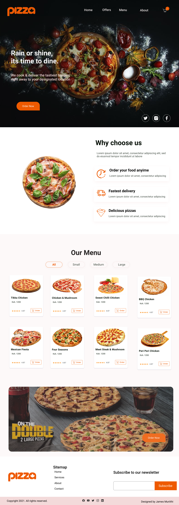

# Pizza Palace
Rain or shine, its time to dine from your favourite pizza place.

## Description
We cook & deliver the tastiest pizzas  right away to your location at your comfort.

## Demo
[Here](james-muriithi.github.io/pizza-palace) is the link to the demo.

## Technologies Used
1. HTML
1. CSS
1. JS
1. JQuery

## How to setup
Download or clone the project
```shell
foo@bar: ~$ git clone https://github.com/james-muriithi/delani-stuio.git
```
Navigate to the cloned or downloaded folder
Open index.html file with your browser

## User Story (BDD)
1. Choose the size of pizza I want e.g Small, Medium, Large
1. Choose what kind of crust I would like the pizza to have e.g Crispy, Stuffed, Gluten-free
1. Choose the topping(s) I want on my pizza.
1. Place an order for my Pizza and see the total charge for it.
1. Have an option to order as many pizzas as I want.
1. Have an option to have the pizza delivered or not.  If delivered I want to be alerted how much the delivery charge will be.
1. If I want my pizza to be delivered, I want to be prompted to enter where the delivery should be made and an alert saying '' your order will be delivered to your location"
1. See a checkout button that when clicked shows the total amount charged for the orders.

## Design
[Here](https://www.figma.com/file/J46HCyFn9bSJIu4tkqH46h/Pizza-Palace?node-id=2%3A4) is the link to the design preview.


## Screenshot


## Contact
To make a contribution to the code used or any suggestions you can click on the contact link and email me your suggestions.

Email: james.muthike@student.moringaschool.com

## Licence
Copyright (c) 2021 Moringa school

Permission is hereby granted, free of charge, to any person obtaining a copy of this software and associated documentation files , to deal in the Software without restriction, including without limitation the rights to use, copy, modify, merge, publish, distribute, sublicense, and/or sell copies of the Software, and to permit persons to whom the Software is furnished to do so, subject to the following conditions:

The above copyright notice and this permission notice shall be included in all copies or substantial portions of the Software.

THE SOFTWARE IS PROVIDED "AS IS", WITHOUT WARRANTY OF ANY KIND, EXPRESS OR IMPLIED, INCLUDING BUT NOT LIMITED TO THE WARRANTIES OF MERCHANTABILITY, FITNESS FOR A PARTICULAR PURPOSE AND NONINFRINGEMENT. IN NO EVENT SHALL THE AUTHORS OR COPYRIGHT HOLDERS BE LIABLE FOR ANY CLAIM, DAMAGES OR OTHER LIABILITY, WHETHER IN AN ACTION OF CONTRACT, TORT OR OTHERWISE, ARISING FROM, OUT OF OR IN CONNECTION WITH THE SOFTWARE OR THE USE OR OTHER DEALINGS IN THE SOFTWARE.